ADVERSARIAL MODELS
------------------

```
GAN Goodfellow 2014
    Generative Adversarial Networks
    https://arxiv.org/abs/1406.2661
    Implemented this and ran on MNIST digits. Worked alright but output images
    were a bit noisy.
```

```
DCGAN Radford 2016
    Unsupervised Representation Learning with Deep Convolutional:
    https://arxiv.org/abs/1511.06434
    Implemented this and ran on MNIST digits. Rsults better than GAN. When I
    naievly tried to scale up the input tensor for generative CNN, the output
    image did not look like a proper texture.
```

```
SGAN Jetchev 2017
    Texture Synthesis with Spatial Generative Adversarial Networks
    https://arxiv.org/abs/1611.08207
    This is a simple extension of Radford 2016 [2] that enables us to scale
    up the generated image to abitrary size. This is essential for texture
    generation.
```


```
SinGAN Shaham 2019
    Learning a Generative Model from a Single Natural Image
    https://arxiv.org/abs/1905.01164
```


DIFFUSION MODELS
----------------

```
DDPM
    Ho 2020 Denoising Diffusion Probabilistic Models
    https://arxiv.org/abs/2006.11239
    I havent fully implemented this.
```


SGAN
----

Training Image:

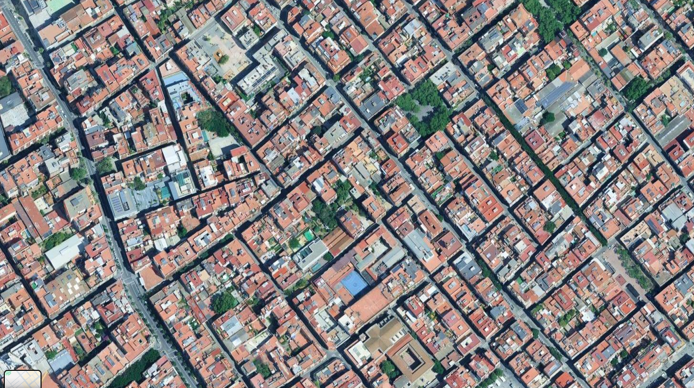

Generated Image:

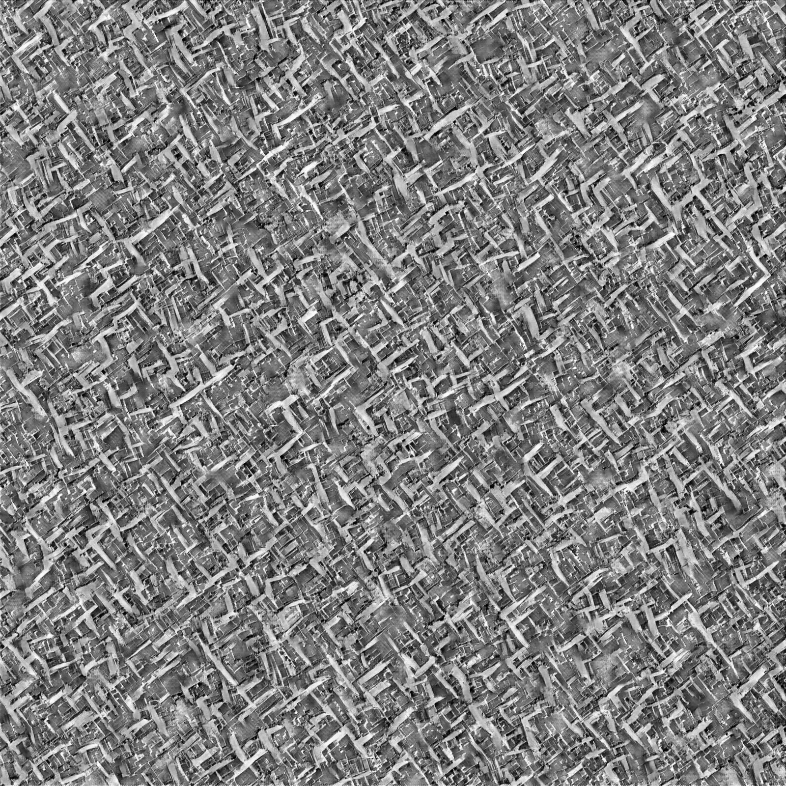


SinGAN
------

Training Image:


Generated Images:

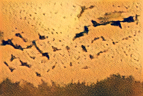
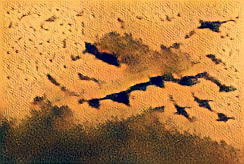
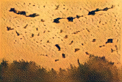
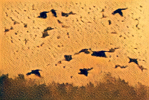
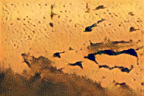
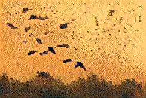
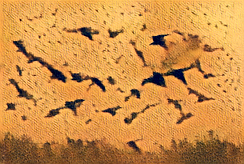

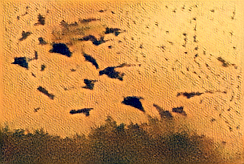
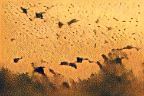
